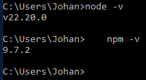
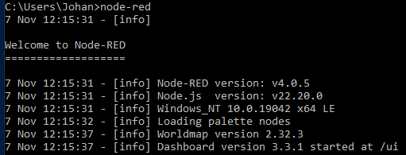
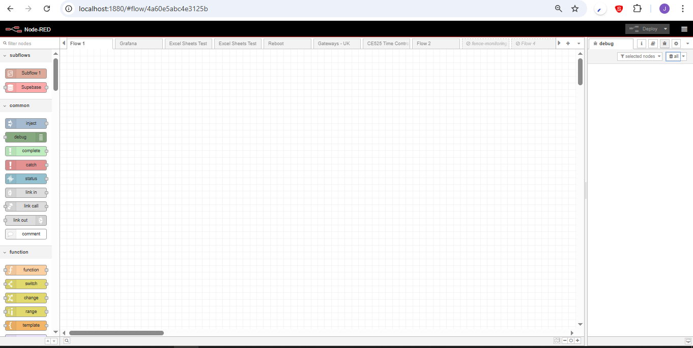
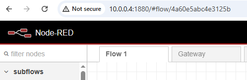
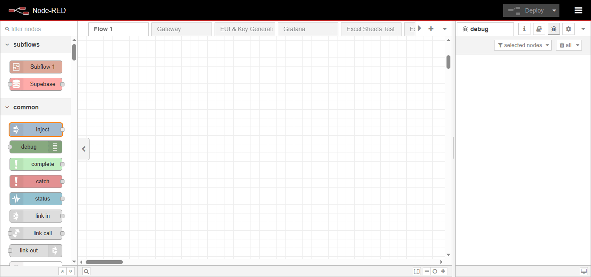

# Fundamentals

## 1.  Introduction to Node-RED

Node-Red had its birth at IBM early 2013 when they wanted to visualize MQTT topics. The main developers at that stage were Nick O'Leary and Dave Conway-Jones.

In September 2013 it were open-sourced and made available to the public. And by October 2016 became one of the founding projects of the JavaScrip Foundation (JS Foundation). Later in March 2019 the JS Foundation merged with Node.js Foundation to form the OpenJS Foundation.

Today it has moved on to be a Ubiquitous Low-Code Tool, Node-Red has as moved far beyond just IoT. It is now used globally for: industrial automation (IIoT), home automation, API creation, ETL/data flow pipelines, and rapid prototyping, all powered by its simple, visual, flow-based programming model running on Node.js.

## 2. Installation and Setup

Setting up Node-RED is surprisingly straightforward, considering the power it unlocks. The most critical thing to remember is that Node-RED runs on top of Node.js, so that's your essential first step.

### 2.1 Installation & Setup: The Two-Step Process
The standard, most flexible way to install Node-RED on Windows, macOS, or Linux is via its package manager, npm.

#### Step 1: Install Node.js
Node-RED is a Node.js application, so you must install the Node.js runtime first.

To install Node.js, follow these steps, which are generally applicable across Windows, macOS, and Linux, with slight variations depending on the operating system:

- **1.1. Download**:
    - [Visit the official Node.js website.](https://nodejs.org/en/download/)
    - Download the appropriate installer for your operating system and architecture (32-bit or 64-bit). The LTS (Long Term Support) version is recommended for most users due to its stability.

- **1.2. Install:**
    - Locate the downloaded installer file (e.g., a .msi file on Windows, a .pkg on macOS, or a package for Linux).
    - Double-click the installer to begin the setup wizard.
    - Follow the prompts in the wizard, accepting the license agreement and using the default settings for installation unless you have specific reasons to change them. This typically includes installing the Node.js runtime and the npm package manager.

- **1.3. Complete the Setup:**
    - The installer may offer to install additional tools like Python and Visual Studio Build Tools, which are necessary for compiling some native Node.js modules. Choose to install these if prompted.
    - Click "Install" to begin the installation process.
    - Once the installation is complete, click "Finish" to close the wizard.

- **1.4. Verify:** 
    - Open your terminal or command prompt.
    - Run the following commands to check the installed versions of Node.js and npm:

    ```
    node -v
    npm -v
    ```
You should see version numbers for both node and npm (Node Package Manager). If you do, you're good to go.



#### Step 2: Install and Run Node-RED
With Node.js and npm in place, installing Node-RED is a single command.

- **2.1. Install Node-RED (Globally)**
Run the following command in your terminal/command line:

    ```
    # This command installs Node-RED globally, allowing you to run it from any directory
    npm install -g --unsafe-perm node-red
    ```
    💡 Note on --unsafe-perm: This option is often needed to correctly install dependencies that require compiling native code (especially on Linux/Mac). It ensures smooth installation. On Windows, the sudo prefix is not used.

#### 2. Run Node-RED
Once the installation is complete, you can start the Node-RED server with a simple command:
```
node-red
```



- **Access the Editor**
When Node-RED starts, you will see a bunch of log messages, including a line that tells you the server is running.
    - Look for the line that says: Server now running at http://127.0.0.1:1880/ (or http://localhost:1880/

     - Open your web browser and navigate to that address.



Congratulations! You are now looking at the Node-RED flow editor, ready to start dragging, dropping, and wiring up your first automation flow.

---

## 3.Raspberry Pi

We are going to use a Raspberry PI for this course, and the following on course. It will be good at this point to get you Pi up and running.


### 3.1 Installation & Setup PI:
The Raspberry Pi has a dedicated installation script that handles the Node.js install, Node-RED install, and sets it up as a system service for easy management and automatic startup.

```
bash <(curl -sL https://raw.githubusercontent.com/node-red/linux-installers/master/deb/update-nodejs-and-nodered)
```

This script is the recommended (and easiest) way to get it running on any Debian-based system like Raspberry Pi OS.

### 3.1 Running locally

Open the terminal and run the command
```
node-red
```
You can stop Node-Red with the command by pressing Ctrl-C or by closing the terminal window.

Due to limited memory on you Raspberry PI we need start Node_red with the following command.
```
node-red-pi --max-old-space-size=256
```
This will tell the underling Node.js process to free up some additional unused memory.

### 3.2 Autostart at boot
If you want Node-RED to start automatically when the system boots or on re-boot. You can enable the service to autostart with the following command.
```
sudo systemctl enable nodered.service
```
To disable the service on the next boot, run the command
```
sudo systemctl disable nodered.service
```

### 3.3 Opening the Editor
Once Node-Red is running, you can open it in the browser.

You can navigate to http://localhost:1880 or http://127.0.0.1:1880/ or you can navigate to the Raspberry PI IP address and use port 1880.

You can find the PI IP by running the command in the terminal.
```
hostname -I
```

In this case my IP is 10.0.0.4



## 4. The Editor and Interface

When you navigate to http://localhost:1880/ (or your chosen address), you see the Node-RED editor, which is divided into three main zones .

### 4.1 The Left Zone: The Palette
The Palette is the library of all the reusable components—the "blocks" of code—that you can drag onto the canvas.

- Nodes: These are the fundamental units of Node-RED. They do the actual work.

    - Input Nodes (Inject, HTTP In, MQTT In): They start a flow, acting as triggers.

    - Output Nodes (Debug, HTTP Response, MQTT Out): They end a flow or send data out to an external system.

    - Function Nodes (Function, Change, Switch): They perform logic, manipulate data, or allow you to write small snippets of JavaScript.

- Managing the Palette: You can add hundreds of community-contributed nodes (for databases, specific cloud services, complex protocols, etc.) via the Manage Palette option in the main menu.

### 4.2 The Center Zone: The Workspace (Flows/Tabs)
This is the main canvas where you build your logic by wiring nodes together.

- Flows (Tabs): These are separate, independent canvas sheets, acting like different pages or modules in your application.

    - You can use them to logically group different parts of your project (e.g., one flow for Data Collection, another for Dashboard UI, and a third for System Alerts).

    - The entire set of flows is saved into a single file (usually flows.json).

- Wiring: You connect the output port on the right side of one node to the input port on the left side of the next. The lines connecting them represent the flow of a single object, the message (msg), which carries the data.

### 4.3 The Right Zone: Sidebars

The right sidebar is context-sensitive and has three crucial tabs for development and debugging:

|Tab |Purpose    |Why it Matters (The Wit)   |
|----|-----------|---------------------------|
|Info   |Documentation and Context. Shows the description and properties of the currently selected node, including its inputs and outputs.  |It's the instruction manual you actually read (because it's right there!).|
|Help   |External Documentation. Provides links to the Node-RED documentation and forum, often showing help specific to the node you are currently editing. |When the Info tab is too brief, this is the escape hatch to the wider world of knowledge.|
|Debug  |Real-time Output and Error Monitoring. Displays messages sent from Debug nodes in your flows. This is your primary tool for seeing what data is flowing through your system.   |This is where you talk to your flow and it talks back. If it's silent, something is broken.|
|Config |Configuration Nodes. Shows a list of all server-level settings (e.g., MQTT server connections, database connections, API keys) shared across multiple flows.   |These are the things that need a permanent home, not just a one-time connection.|
|Context    |State Data Viewer. Allows you to view the data currently stored in the Node-RED environment's persistent memory (Flow Context and Global Context). |It's the "brain" of your server—where flows keep track of things like counters, statuses, and persistent variables.|
|Dashboard  |UI/Layout Management. (Requires the node-red-dashboard node set to be installed.) This is where you manage the layout, groups, and themes for your custom web user interface.  |This is the interior designer for your user interface; where you decide how your buttons and charts look.|

### 4.4 The Process: The Deploy Button

The Deploy button (top-right corner, usually bright red) is how you move your visual design into the running application.

- What it does: When you hit Deploy, the Node-RED runtime stops the current flows, saves the new flows to the flows.json file on the server, and then starts the new, updated flows.

- Crucial Tip: Unlike traditional programming where code runs instantly after saving, a change in Node-RED only takes effect after you hit the Deploy button. You can choose to deploy only the Modified Flows or the Full Flows.

Ready to start learning what actually travels along those wires? We'll jump into the Message Object next!

## 5. Your First Flow

The goal is to manually trigger a flow and see the resulting message object in the Debug sidebar.

### 5.1 Step 1: Open the Editor
Make sure your Node-RED server is running (you ran the node-red command earlier) and open your browser to http://localhost:1880/.

### 5.2 Step 2: Drag and Drop the Nodes
Locate the following nodes in your Palette (the left sidebar) and drag them onto the central Workspace.

|Node Name	|Node Type (Color)	|Function|
|-----------|-------------------|--------|
|Inject	|Input (Blue)	|Creates and sends a message object. This is your manual trigger.|
|Debug	|Output (Green)	|Displays the contents of the message object it receives in the Debug sidebar.|

### 5.3 Step 3: Wire the Nodes
Connect the output of the Inject node to the input of the Debug node:
1. Click and drag from the small gray box (the output port) on the right side of the Inject node.
2. Drop the wire onto the gray box (the input port) on the left side of the Debug node.
3. You should now have a solid line connecting the two nodes.

### 5.4 Step 4: Configure the Inject Node
By default, the Inject node sends a JavaScript timestamp. Let's change it to something custom.

1. Double-click the Inject node to open its configuration panel.

2. In the Payload dropdown menu (which currently says "Timestamp"), change the type to string.

3. In the input field next to it, type the text: Hello Node-RED!

    Click the red Done button.


### 5.5 Step 5: Deploy the Flow
Your flow is just a drawing until you tell Node-RED to run it.

1. Click the red Deploy button in the top-right corner of the editor.

2. You should see a brief "Successfully deployed" notification.

### 5.6 Step 6: Trigger the Flow

1. On the right sidebar, click the Debug tab

2. Click the square button on the left side of the Inject node in your workspace. This manually triggers the flow.

3. Instantly, the Debug sidebar should light up and display the message you sent:
    ```
    "Hello Node-RED!"
    ```
    (The message will be contained within the msg.payload property, which you will learn about shortly!)

You have now successfully built, deployed, and run your first working automation flow! This simple sequence is the basis for everything you will build in Node-RED




